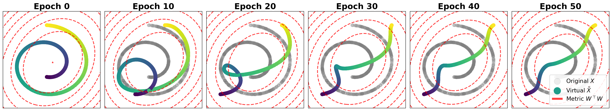

# Code for "The Weight Gram Matrix Captures Sequential Feature Linearization in Deep Networks"

The virtual update progressively unrolls a Swiss roll into a near-linear curve along the target (encoded by color), shown across training epochs.

[Paper (Arxiv)](https://arxiv.org/abs/2605.06258)

## TL;DR

Simple chain rule makes the weight Gram matrix the bridge between weight and feature evolution. 
The Gram learns the Virtual Covariance, and captures Target Linearity, which unifies other feature learning phenomena including Neural Collapse.

## Abstract

Understanding how deep neural networks learn representations remains a central challenge in machine learning theory. 
In this work, we propose a feature-centric framework for analyzing neural network training by relating weight updates to feature evolution. 
We introduce a simple identity, the *Feature Learning Equation*, which identifies the weight Gram matrix as the key object capturing feature dynamics. 
This enables us to interpret gradient descent as implicitly inducing a hypothetical evolution of features, whose covariance structure — termed the *Virtual Covariance* — characterizes how representations evolve during training.
Building on this perspective, we introduce *Target Linearity*, a measure quantifying the linear alignment between features and targets. 
By analyzing the training and layer-wise dynamics, we show that deep networks learn to *sequentially* transform representations toward target-linear structure. 
This linearization perspective provides a unified interpretation of several empirical phenomena, including Neural Collapse and linear interpolation in generative models.

## Setup

- Install requirement with `pip install -r requirements.txt`

## Reproducing Experiments

- Figure 1 (Swiss roll linearization): Run `notebook/swissroll.ipynb`.
- Figure 2 (Gram whitening): Run `src/experiment/whiten.py` and check `notebook/whitening_ploy.ipynb`.  (Run `whiten_cnn.py` for Figure 6)
- Figure 4 (Surrogate and TL): Run `src/experiment/target_linearity.py` and check `notebook/metrics_plot.ipynb`. (Change `SGD` to `Adam` in `target_linearity.py` for Figure 9)
- Figure 5 (VAE Interpolation): Run `src/experiment/vae_train.py`, `src/experiment/vae_target_linearity.py`, and check `notebook/vae_interpolation.ipynb`.
- Figure 8 (Staircase Experiment): Check `notebook/staircase.ipynb`.
- Figure 10 (TL in VAE): Run `src/experiment/vae_train.py`, `src/experiment/vae_target_linearity.py`, and check `notebook/vae_plot.ipynb`.
- Figure 11 (TL in BERT): Run `src/experiment/bert_train.py`, `src/experiment/bert_target_linearity.py`, and check `notebook/bert_plot.ipynb`.
- Figure 12 (Random label training): Run `src/experiment/random_label.py` and check `notebook/random_label_plot.ipynb`.
- Figure 13 (Grokking): Run `src/experiment/grokking.py` and check `notebook/grokking_plot.ipynb`.
